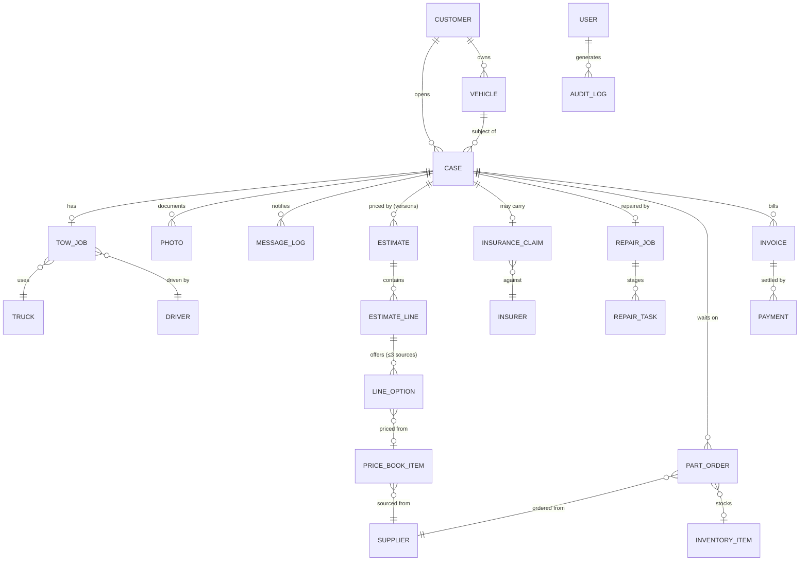

# 06 — Data Model & Architecture

## Case state machine

The case is the spine; every other record hangs off it. Transitions stamp who/when/why — the customer timeline (C6) and console timeline (O4) are renderings of this machine.

```mermaid
stateDiagram-v2
    direction LR
    [*] --> NEW : SOS / link / phone-in
    NEW --> TOW_ASSIGNED : dispatcher assigns
    TOW_ASSIGNED --> PICKED_UP : driver loads (photos forced)
    PICKED_UP --> AT_WORKSHOP : handover signed
    AT_WORKSHOP --> ESTIMATE_SENT : estimate v1 (SLA ≤ 3 wh)
    ESTIMATE_SENT --> ESTIMATE_SENT : question → v2, v3…
    ESTIMATE_SENT --> APPROVED : OTP approval + deposit
    ESTIMATE_SENT --> DECLINED : customer declines / silence exhausted
    APPROVED --> IN_REPAIR : parts secured
    IN_REPAIR --> IN_REPAIR : QC fail → rework
    IN_REPAIR --> READY : QC checklist + photos pass
    READY --> DELIVERED : pickup or paid delivery (invoice issued)
    DELIVERED --> CLOSED_PAID : balance settled
    DECLINED --> CLOSED_TOW_ONLY : tow fee paid + PDF delivered
    DECLINED --> REFERRED_OUT : paid delivery elsewhere
    NEW --> CANCELLED : before pickup (free)
    TOW_ASSIGNED --> CANCELLED : before pickup (free)
    CLOSED_PAID --> [*]
    CLOSED_TOW_ONLY --> [*]
    REFERRED_OUT --> [*]
    CANCELLED --> [*]
```

The **insurance claim** runs as a parallel sub-state on insurance cases: `CLAIM_REPORTED → ASSESSED → APPROVED | CASH_SETTLED → PAID_OUT`, each stage with owner + age; claim approval/settlement is what triggers `APPROVED` on insurer-paid repairs.

## Entity-relationship model

## Entity dictionary (key fields; 🔒 = owner/accountant scope)

| Entity | Key fields |
|---|---|
| CASE | `id (SLM-####)`, status, pay_type (cash/شامل/ضد الغير), channel (app/link/phone), next_action_owner, aging timestamps, opened/closed_at, decline_reason |
| CUSTOMER | name, phone (login identity), language, referral_code, rating_given |
| VEHICLE | make/model/year, color, plate, VIN, odometer |
| TOW_JOB | pickup geo + address text, destination, fee, free_if_repair flag, status, timestamps per hop, POD |
| TRUCK / DRIVER | plate, TGA license + expiry / license, phone, commission scheme, shift status, rating |
| PHOTO | case_id, stage (scene/pickup/intake/repair-stage/QC/delivery), geo/time, author, consent_flag |
| MESSAGE_LOG | case_id, channel (wa/sms/push), template_id, payload, delivery status |
| ESTIMATE | case_id, version, status, validity_until, approved_via (OTP record), approved_snapshot (immutable JSON) |
| ESTIMATE_LINE | type (part/labor/paint/fee), title_ar, qty, selected_option, zone_ref |
| LINE_OPTION | source (أصلي/تجاري/مستعمل), cost 🔒, price, warranty_text, availability_days, price_book_ref |
| PRICE_BOOK_ITEM | part × model/years × source, supplier_id, cost 🔒, price, dealer_ref, lead_days, updated_at |
| SUPPLIER | name, type (وكيل/تجاري/تشليح), lead time, reliability score |
| INSURANCE_CLAIM | case_id, insurer_id, najm_no + file, policy_ref, stage, expected_amount, settled_amount, stage timestamps, next_action_owner |
| INSURER | name, contacts, avg cycle days per stage (computed) |
| REPAIR_JOB / REPAIR_TASK | stage, eta, qc_checklist, qc_passed / assignee, stage photos, notes |
| PART_ORDER | supplier_id, case_id, lines, status (ordered/shipped/received/inspected), eta, inspection photo |
| INVENTORY_ITEM | sku, on_hand, min_level (consumables) |
| INVOICE | case_id, seq number, type (simplified/standard), vat breakdown, zatca_qr (TLV), immutable; credit notes reference original |
| PAYMENT | invoice_id, method (mada/applepay/link/transfer/cash/insurer), kind (deposit/final/tow/delivery), amount, proof, collector |
| EXPENSE 🔒 | category, amount, receipt photo, month |
| USER / ROLE | identity, role, permissions per matrix |
| AUDIT_LOG | actor, action, entity, before/after, at |

## Permissions matrix

| Capability | Owner | Dispatcher | Estimator | Technician | Driver | Accountant |
|---|---|---|---|---|---|---|
| Cases & timeline | all | all | all | workshop view | own jobs | read |
| Dispatch & trucks | ✓ | ✓ | — | — | own jobs | — |
| Estimates (prices) | ✓ | read | create/send | read scope | — | read |
| Costs & margins 🔒 | ✓ | — | costs only | — | — | read |
| Price book edit | ✓ | — | propose | — | — | — |
| Insurance claims | ✓ | read | ✓ | — | — | receivables |
| Finance & invoices | ✓ | — | — | — | collect+log | ✓ |
| Discounts | any | — | to floor % | — | — | — |
| Settings/staff/config | ✓ | — | — | — | — | — |

Enforcement is server-side (API scope), not UI hiding; cost/margin fields are absent from non-privileged payloads.

## Recommended stack

| Layer | Choice | Why |
|---|---|---|
| App framework | Next.js (TypeScript) monorepo — customer PWA + console + magic-link pages | One codebase, SSR for link pages, PWA installability; native wrappers (Expo/Capacitor) in Phase 2 |
| API | tRPC or REST + Zod validation | End-to-end types; the permissions matrix lives here |
| Database | PostgreSQL (Supabase or RDS) + Prisma | Relational fits the model; row-level security assists roles; realtime for dispatch/kanban |
| Files | S3-compatible object storage, image compression pipeline | Photo volume is the biggest data class |
| Auth | Phone OTP (customers) via SMS/WhatsApp; email+passkey (staff) | Matches market behavior |
| Maps | Google Maps Platform (Places AR, Directions, ETA) | Best Riyadh coverage incl. Arabic addresses |
| Messaging | WhatsApp Business Cloud API (or via Unifonic/Twilio BSP) + SMS fallback (Unifonic/Msegat) | WhatsApp is the customer channel in KSA |
| Payments | Moyasar (or Tap/HyperPay) — mada, Apple Pay, cards, payment links | Saudi PSP, webhook reconciliation |
| E-invoicing | ZATCA TLV QR generation now; Phase 2 FATOORA integration when thresholds require | Legal requirement |
| Hosting | In-region: GCP Dammam (me-central2) or AWS Bahrain (me-south-1) | Latency + PDPL data-residency posture |
| Realtime | Postgres LISTEN/replication or Supabase Realtime; driver GPS via lightweight WebSocket | Dispatch board + tracking |
| Observability | Sentry + structured audit log (own table) | Disputes are resolved by records |

Offline-first requirements: driver photo capture and status actions queue locally (industrial areas and basements have dead zones) and sync with conflict-safe, idempotent writes.

## Integrations reality check

- **Najm / insurers / Taqdeer:** no public APIs — model them as tracked external actors (statuses updated by staff); pursue direct-billing agreements at volume (Phase 3).
- **WhatsApp templates** require Meta approval lead time — submit template set (see 04 matrix) during development, not at launch.
- **ZATCA:** simplified invoices with QR from day one; monitor wave thresholds for Phase 2 platform integration.

## Compliance & legal flags (verify with counsel before launch)

| Area | Flag |
|---|---|
| PDPL (Saudi data protection) | Consent at collection (photos, location), purpose limitation, in-region hosting preference, deletion policy; marketing reuse of photos gated on explicit consent flag |
| TGA (Transport General Authority) | Tow-truck operating licenses and driver requirements; expiry tracking is built into the truck registry |
| ZATCA | VAT registration, invoice numbering, QR compliance, credit-note handling |
| Consumer protection (MoC) | Written estimates, warranty obligations, storage-fee disclosure rules |
| Insurance practice | Our estimates/advice must not misrepresent; settlement advisor copy reviewed for compliance |
