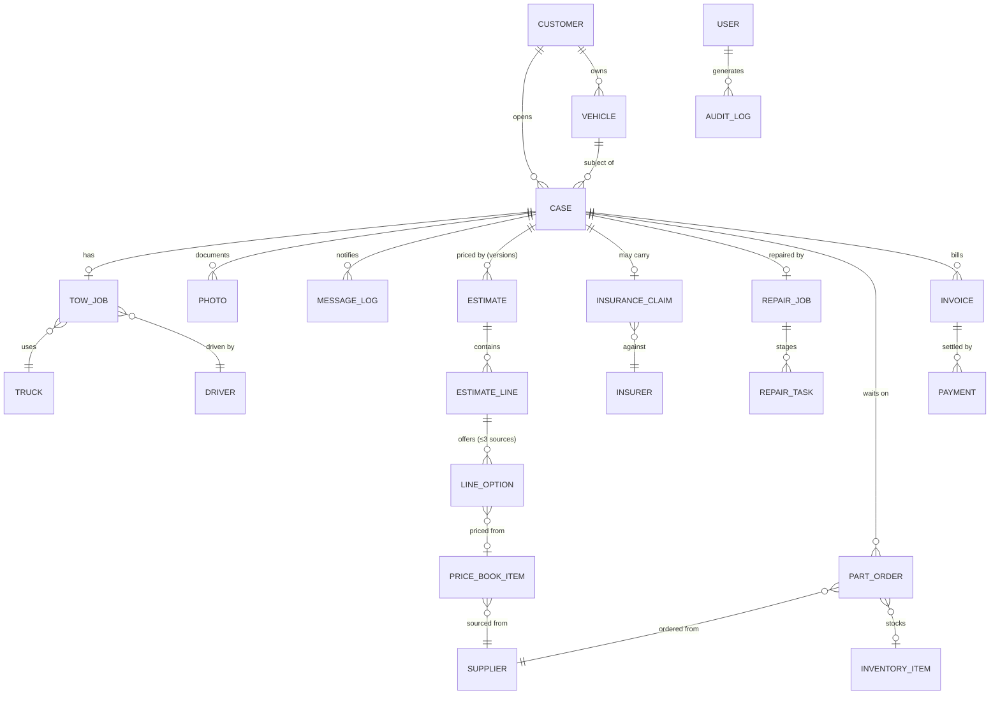

# 06 — نموذج البيانات والبنية التقنية

## آلة حالات القضية

القضية هي العمود الفقري، وكل سجل آخر في النظام يتفرع منها. كل انتقال بين الحالات يُختم بمن قام به ومتى ولماذا — فالخط الزمني للعميل (C6) والخط الزمني في لوحة الإدارة (O4) ليسا سوى عرضين لهذه الآلة.

```mermaid
stateDiagram-v2
    direction LR
    [*] --> NEW : SOS / link / phone-in
    NEW --> TOW_ASSIGNED : dispatcher assigns
    TOW_ASSIGNED --> PICKED_UP : driver loads (photos forced)
    PICKED_UP --> AT_WORKSHOP : handover signed
    AT_WORKSHOP --> ESTIMATE_SENT : estimate v1 (SLA ≤ 3 wh)
    ESTIMATE_SENT --> ESTIMATE_SENT : question → v2, v3…
    ESTIMATE_SENT --> APPROVED : OTP approval + deposit
    ESTIMATE_SENT --> DECLINED : customer declines / silence exhausted
    APPROVED --> IN_REPAIR : parts secured
    IN_REPAIR --> IN_REPAIR : QC fail → rework
    IN_REPAIR --> READY : QC checklist + photos pass
    READY --> DELIVERED : pickup or paid delivery (invoice issued)
    DELIVERED --> CLOSED_PAID : balance settled
    DECLINED --> CLOSED_TOW_ONLY : tow fee paid + PDF delivered
    DECLINED --> REFERRED_OUT : paid delivery elsewhere
    NEW --> CANCELLED : before pickup (free)
    TOW_ASSIGNED --> CANCELLED : before pickup (free)
    CLOSED_PAID --> [*]
    CLOSED_TOW_ONLY --> [*]
    REFERRED_OUT --> [*]
    CANCELLED --> [*]
```

تعمل **مطالبة التأمين** كحالة فرعية موازية في قضايا التأمين: `CLAIM_REPORTED → ASSESSED → APPROVED | CASH_SETTLED → PAID_OUT`، ولكل مرحلة مسؤول وعمر زمني؛ والموافقة على المطالبة أو تسويتها هي ما يُفعّل حالة `APPROVED` في الإصلاحات التي تدفعها شركة التأمين.

## نموذج الكيانات والعلاقات

## قاموس الكيانات (الحقول الرئيسية؛ 🔒 = نطاق المالك/المحاسب)

| الكيان | الحقول الرئيسية |
|---|---|
| CASE | `id (SLM-####)`، status، pay_type (كاش/شامل/ضد الغير)، channel (تطبيق/رابط/هاتف)، next_action_owner، طوابع زمنية للتقادم، opened/closed_at، decline_reason |
| CUSTOMER | name، phone (هوية تسجيل الدخول)، language، referral_code، rating_given |
| VEHICLE | make/model/year، color، plate، VIN، odometer |
| TOW_JOB | إحداثيات موقع الالتقاط + نص العنوان، destination، fee، راية free_if_repair، status، طوابع زمنية لكل محطة، POD |
| TRUCK / DRIVER | plate، رخصة TGA + تاريخ انتهائها / license، phone، نظام العمولة، حالة الوردية، rating |
| PHOTO | case_id، stage (موقع الحادث/التحميل/الاستلام/مرحلة الإصلاح/فحص الجودة/التسليم)، geo/time، author، consent_flag |
| MESSAGE_LOG | case_id، channel (wa/sms/push)، template_id، payload، حالة التسليم |
| ESTIMATE | case_id، version، status، validity_until، approved_via (سجل OTP)، approved_snapshot (JSON غير قابل للتعديل) |
| ESTIMATE_LINE | type (قطعة/عمالة/دهان/رسوم)، title_ar، qty، selected_option، zone_ref |
| LINE_OPTION | source (أصلي/تجاري/مستعمل)، cost 🔒، price، warranty_text، availability_days، price_book_ref |
| PRICE_BOOK_ITEM | القطعة × الطراز/السنوات × المصدر، supplier_id، cost 🔒، price، dealer_ref، lead_days، updated_at |
| SUPPLIER | name، type (وكيل/تجاري/تشليح)، مدة التوريد، درجة الموثوقية |
| INSURANCE_CLAIM | case_id، insurer_id، najm_no + الملف، policy_ref، stage، expected_amount، settled_amount، طوابع زمنية للمراحل، next_action_owner |
| INSURER | name، contacts، متوسط أيام الدورة لكل مرحلة (محسوب) |
| REPAIR_JOB / REPAIR_TASK | stage، eta، qc_checklist، qc_passed / assignee، صور المراحل، notes |
| PART_ORDER | supplier_id، case_id، lines، status (مطلوب/مشحون/مستلم/مفحوص)، eta، صورة الفحص |
| INVENTORY_ITEM | sku، on_hand، min_level (المستهلكات) |
| INVOICE | case_id، رقم تسلسلي، type (مبسطة/قياسية)، تفصيل ضريبة القيمة المضافة، zatca_qr (TLV)، غير قابلة للتعديل؛ والإشعارات الدائنة تُحيل إلى الفاتورة الأصلية |
| PAYMENT | invoice_id، method (مدى/أبل باي/رابط/تحويل/كاش/شركة التأمين)، kind (عربون/نهائي/سحب/توصيل)، amount، proof، collector |
| EXPENSE 🔒 | category، amount، صورة الإيصال، month |
| USER / ROLE | identity، role، الصلاحيات وفق المصفوفة |
| AUDIT_LOG | actor، action، entity، before/after، at |

## مصفوفة الصلاحيات

| القدرة | المالك | الموزّع | المُسعِّر | الفني | السائق | المحاسب |
|---|---|---|---|---|---|---|
| القضايا والخط الزمني | الكل | الكل | الكل | عرض الورشة | مهامه | قراءة |
| التوزيع والشاحنات | ✓ | ✓ | — | — | مهامه | — |
| العروض (الأسعار) | ✓ | قراءة | إنشاء/إرسال | قراءة ضمن نطاقه | — | قراءة |
| التكاليف والهوامش 🔒 | ✓ | — | التكاليف فقط | — | — | قراءة |
| تعديل دليل الأسعار | ✓ | — | يقترح | — | — | — |
| مطالبات التأمين | ✓ | قراءة | ✓ | — | — | المستحقات |
| المالية والفواتير | ✓ | — | — | — | تحصيل وتسجيل | ✓ |
| الخصومات | أي خصم | — | حتى حد الهامش | — | — | — |
| الإعدادات/الموظفون/التهيئة | ✓ | — | — | — | — | — |

يُفرض التحكم على جانب الخادم (نطاق API)، لا بإخفاء عناصر الواجهة؛ فحقول التكلفة والهامش غائبة أصلًا من الحمولات المُرسلة إلى الأدوار غير المخوّلة.

## الحزمة التقنية الموصى بها

| الطبقة | الاختيار | السبب |
|---|---|---|
| إطار التطبيق | مستودع أحادي (monorepo) بإطار Next.js (TypeScript) — تطبيق PWA للعميل + لوحة الإدارة + صفحات الروابط المباشرة | قاعدة كود واحدة، وSSR لصفحات الروابط، وقابلية التثبيت كتطبيق PWA؛ والأغلفة الأصلية (Expo/Capacitor) في المرحلة 2 |
| واجهة البرمجة (API) | tRPC أو REST + تحقق عبر Zod | أنواع مضمونة من الطرف إلى الطرف؛ وموطن مصفوفة الصلاحيات هنا |
| قاعدة البيانات | PostgreSQL (Supabase أو RDS) + Prisma | العلائقية تناسب النموذج؛ وأمان مستوى الصفوف يدعم الأدوار؛ والتحديث اللحظي للتوزيع ولوحة كانبان |
| الملفات | تخزين كائنات متوافق مع S3، وخط معالجة لضغط الصور | حجم الصور هو أكبر فئات البيانات |
| المصادقة | رمز OTP عبر الهاتف (للعملاء) بواسطة SMS/واتساب؛ وبريد إلكتروني + مفتاح مرور (للموظفين) | يطابق سلوك السوق |
| الخرائط | Google Maps Platform (خدمة Places بالعربية، وDirections، وETA) | أفضل تغطية للرياض بما يشمل العناوين العربية |
| المراسلة | WhatsApp Business Cloud API (أو عبر مزود BSP مثل Unifonic/Twilio) + قناة SMS احتياطية (Unifonic/Msegat) | واتساب هو قناة التواصل مع العملاء في السعودية |
| المدفوعات | Moyasar (أو Tap/HyperPay) — مدى وApple Pay والبطاقات وروابط الدفع | مزود مدفوعات سعودي، ومطابقة عبر webhook |
| الفوترة الإلكترونية | توليد رمز QR بترميز TLV وفق ZATCA الآن؛ وتكامل مع FATOORA في المرحلة 2 عندما تستوجب الحدود ذلك | متطلب قانوني |
| الاستضافة | داخل المنطقة: GCP Dammam (me-central2) أو AWS Bahrain (me-south-1) | زمن الاستجابة + وضعية إقامة البيانات وفق PDPL |
| الزمن الحقيقي | Postgres LISTEN/replication أو Supabase Realtime؛ وGPS السائق عبر WebSocket خفيف | لوحة التوزيع + التتبع |
| المراقبة | Sentry + سجل تدقيق مهيكل (جدول مستقل) | النزاعات تُحسم بالسجلات |

متطلبات العمل دون اتصال أولًا: يُصفّ التقاط الصور وإجراءات تحديث الحالة لدى السائق في طابور محلي (فالمناطق الصناعية والأقبية فيها مناطق بلا تغطية)، ثم تتزامن عبر عمليات كتابة آمنة من التعارض وثابتة الأثر عند التكرار (idempotent).

## فحص واقع التكاملات

- **نجم / شركات التأمين / تقدير:** لا توجد واجهات برمجة عامة — تُنمذج كأطراف خارجية متتبَّعة (يُحدّث الموظفون حالاتها)؛ مع السعي إلى اتفاقيات فوترة مباشرة عند بلوغ الحجم الكافي (المرحلة 3).
- **قوالب واتساب** تتطلب مهلة اعتماد من Meta — قدّم مجموعة القوالب (انظر مصفوفة 04) أثناء التطوير، لا عند الإطلاق.
- **ZATCA:** فواتير مبسطة مع رمز QR من اليوم الأول؛ مع مراقبة حدود الموجات للتكامل مع المنصة في المرحلة 2.

## إشارات الامتثال والجوانب القانونية (تُراجع مع المستشار القانوني قبل الإطلاق)

| المجال | الإشارة |
|---|---|
| PDPL (نظام حماية البيانات الشخصية السعودي) | الموافقة عند الجمع (الصور والموقع)، وتحديد الغرض، وتفضيل الاستضافة داخل المنطقة، وسياسة الحذف؛ وإعادة استخدام الصور في التسويق مشروطة براية موافقة صريحة |
| TGA (الهيئة العامة للنقل) | رخص تشغيل شاحنات السحب ومتطلبات السائقين؛ وتتبع تواريخ الانتهاء مدمج في سجل الشاحنات |
| ZATCA | التسجيل في ضريبة القيمة المضافة، وترقيم الفواتير، والامتثال لمتطلبات رمز QR، ومعالجة الإشعارات الدائنة |
| حماية المستهلك (MoC) | العروض المكتوبة، والتزامات الضمان، وقواعد الإفصاح عن رسوم التخزين |
| ممارسات التأمين | يجب ألا تنطوي عروضنا أو نصائحنا على أي تحريف؛ وتُراجع نصوص مستشار التعويض من زاوية الامتثال |
